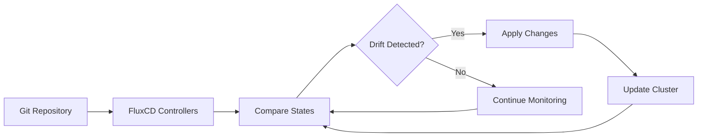

# 🏗️ FluxCD Declarative Infrastructure Implementation Guide

## 📖 Table of Contents
- [🎯 Understanding Declarative Infrastructure](#-understanding-declarative-infrastructure)
- [🔄 FluxCD Reconciliation Process](#-fluxcd-reconciliation-process)
- [🚀 Implementing Declarative Infrastructure](#-implementing-declarative-infrastructure)
- [📦 Kubernetes Manifests Management](#-kubernetes-manifests-management)
- [⚙️ Helm Charts Integration](#️-helm-charts-integration)
- [🎨 Kustomize for Environment Management](#-kustomize-for-environment-management)
- [🔄 Image Automation](#-image-automation)
- [💡 Best Practices & Advanced Patterns](#-best-practices--advanced-patterns)

---

## 🎯 Understanding Declarative Infrastructure

### 📋 Declarative vs Imperative Models

| **Declarative Approach** | **Imperative Approach** |
|---------------------------|-------------------------|
| 🎯 **"What you want"** | 📝 **"How to do it"** |
| Describe desired end state | Provide step-by-step instructions |
| System figures out implementation | Manual execution required |
| Self-healing and drift correction | Manual intervention needed |
| Git as single source of truth | Multiple configuration sources |

### 🧠 Core Principles

#### ✨ Desired State Definition
```yaml
# Example: Desired state for NGINX deployment
apiVersion: apps/v1
kind: Deployment
metadata:
  name: nginx-deployment
spec:
  replicas: 3  # This is your desired state
  selector:
    matchLabels:
      app: nginx
  template:
    metadata:
      labels:
        app: nginx
    spec:
      containers:
      - name: nginx
        image: nginx:1.21
        ports:
        - containerPort: 80
```

> 💡 **Key Concept**: You declare "I want 3 NGINX replicas" - FluxCD ensures this state is maintained.

#### 🔄 Continuous Reconciliation
FluxCD controllers continuously:
1. **Monitor** current cluster state
2. **Compare** with desired state in Git
3. **Detect** discrepancies
4. **Act** to reconcile differences

---

## 🔄 FluxCD Reconciliation Process

### 🎭 The Reconciliation Loop



### 📊 Real-World Scenario: Replica Drift

#### 🎯 Scenario Setup
- **Desired State**: 3 NGINX replicas (defined in Git)
- **Current State**: 2 replicas (due to pod failure)
- **FluxCD Action**: Automatically scale up to 3 replicas

#### 🔍 Monitoring the Process
```bash
# Watch the reconciliation in action
kubectl get deployments nginx-deployment --watch

# Check FluxCD reconciliation status
flux get kustomizations --watch

# View detailed reconciliation events
kubectl describe deployment nginx-deployment
```

#### 📈 Expected Behavior
```bash
# Initial state (drift detected)
NAME               READY   UP-TO-DATE   AVAILABLE   AGE
nginx-deployment   2/3     3            2           5m

# After FluxCD reconciliation
NAME               READY   UP-TO-DATE   AVAILABLE   AGE
nginx-deployment   3/3     3            3           5m
```

### ⚡ Reconciliation Triggers

| **Trigger Type** | **Description** | **Example** |
|------------------|-----------------|-------------|
| 🕐 **Time-based** | Regular interval checks | Every 5 minutes |
| 📡 **Webhook** | Git repository changes | Push to main branch |
| 🚨 **Drift Detection** | Cluster state changes | Manual kubectl edits |
| 🔄 **Manual** | Forced reconciliation | `flux reconcile` command |

---

## 🚀 Implementing Declarative Infrastructure

### 🏁 Step 1: Bootstrap FluxCD

#### 📋 Prerequisites Checklist
- ✅ Kubernetes cluster access
- ✅ Git repository with appropriate permissions
- ✅ FluxCD CLI installed
- ✅ kubectl configured

#### 🔧 Bootstrap Command
```bash
# Bootstrap FluxCD with GitLab
flux bootstrap gitlab \
  --owner=$GITLAB_USER \
  --repository=$GITLAB_REPO \
  --branch=main \
  --path=./clusters/production \
  --personal \
  --token-auth
```

#### 🔍 Verify Bootstrap
```bash
# Check FluxCD installation
kubectl get pods -n flux-system

# Verify GitRepository resource
kubectl get gitrepository -n flux-system

# Check all FluxCD resources
flux get all
```

### 🏗️ Step 2: Repository Structure

#### 📁 Recommended Directory Layout
```
flux-infrastructure/
├── clusters/
│   ├── production/
│   │   ├── flux-system/           # FluxCD bootstrap configs
│   │   ├── infrastructure/        # Core infrastructure
│   │   └── applications/          # Application deployments
│   └── staging/
│       ├── flux-system/
│       ├── infrastructure/
│       └── applications/
├── infrastructure/
│   ├── base/                      # Base configurations
│   ├── nginx/                     # NGINX controller
│   ├── cert-manager/              # Certificate management
│   └── monitoring/                # Monitoring stack
└── applications/
    ├── base/                      # Common app configs
    ├── frontend/                  # Frontend applications
    └── backend/                   # Backend services
```

---

## 📦 Kubernetes Manifests Management

### 🎯 Simple NGINX Deployment Example

#### 📝 Create Deployment Manifest
**File: `infrastructure/nginx/deployment.yaml`**
```yaml
apiVersion: apps/v1
kind: Deployment
metadata:
  name: nginx-deployment
  namespace: default
  labels:
    app: nginx
spec:
  replicas: 3
  selector:
    matchLabels:
      app: nginx
  template:
    metadata:
      labels:
        app: nginx
    spec:
      containers:
      - name: nginx
        image: nginx:1.21
        ports:
        - containerPort: 80
        resources:
          requests:
            memory: "64Mi"
            cpu: "250m"
          limits:
            memory: "128Mi"
            cpu: "500m"
---
apiVersion: v1
kind: Service
metadata:
  name: nginx-service
  namespace: default
spec:
  selector:
    app: nginx
  ports:
  - protocol: TCP
    port: 80
    targetPort: 80
  type: ClusterIP
```

#### 🔧 Create Kustomization Resource
**File: `clusters/production/nginx-kustomization.yaml`**
```yaml
apiVersion: kustomize.toolkit.fluxcd.io/v1
kind: Kustomization
metadata:
  name: nginx
  namespace: flux-system
spec:
  interval: 10m
  path: "./infrastructure/nginx"
  prune: true
  sourceRef:
    kind: GitRepository
    name: flux-system
  targetNamespace: default
  healthChecks:
    - apiVersion: apps/v1
      kind: Deployment
      name: nginx-deployment
      namespace: default
```

#### 🚀 Deploy and Monitor
```bash
# Commit changes to Git
git add -A
git commit -m "Add NGINX deployment"
git push

# Monitor deployment
flux get kustomizations --watch

# Check deployment status
kubectl get deployments
kubectl get services
```

### 🔄 Update Scenarios

#### 📈 Scaling Example
```yaml
# Update replicas in deployment.yaml
spec:
  replicas: 5  # Changed from 3 to 5
```

#### 🔄 Image Update Example
```yaml
# Update container image
containers:
- name: nginx
  image: nginx:1.22  # Updated from 1.21 to 1.22
```

#### 📊 Monitor Updates
```bash
# Watch the rolling update
kubectl rollout status deployment/nginx-deployment

# Check replica scaling
kubectl get rs

# View update history
kubectl rollout history deployment/nginx-deployment
```

---

## ⚙️ Helm Charts Integration

### 📊 Helm Repository Setup

#### 🔧 Create HelmRepository Resource
**File: `infrastructure/helm-repos/nginx-helm-repo.yaml`**
```yaml
apiVersion: source.toolkit.fluxcd.io/v1beta1
kind: HelmRepository
metadata:
  name: nginx-stable
  namespace: flux-system
spec:
  interval: 5m
  url: https://kubernetes.github.io/ingress-nginx
```

### 🎯 Helm Release Management

#### 📝 Create HelmRelease Resource
**File: `infrastructure/nginx/helmrelease.yaml`**
```yaml
apiVersion: helm.toolkit.fluxcd.io/v2beta1
kind: HelmRelease
metadata:
  name: nginx-ingress
  namespace: flux-system
spec:
  interval: 15m
  chart:
    spec:
      chart: ingress-nginx
      version: "4.7.1"
      sourceRef:
        kind: HelmRepository
        name: nginx-stable
        namespace: flux-system
  targetNamespace: nginx-system
  createNamespace: true
  values:
    controller:
      replicaCount: 2
      service:
        type: LoadBalancer
      metrics:
        enabled: true
      podAnnotations:
        prometheus.io/scrape: "true"
        prometheus.io/port: "10254"
```

#### 🔄 Helm Operations Commands
```bash
# List Helm releases managed by FluxCD
flux get helmreleases

# Check Helm repository status
flux get sources helm

# Suspend/Resume Helm release
flux suspend helmrelease nginx-ingress
flux resume helmrelease nginx-ingress

# Force reconciliation
flux reconcile helmrelease nginx-ingress
```

### 📊 Helm Values Management

#### 🎯 Environment-Specific Values
**File: `clusters/production/nginx-values.yaml`**
```yaml
apiVersion: v1
kind: ConfigMap
metadata:
  name: nginx-values
  namespace: flux-system
data:
  values.yaml: |
    controller:
      replicaCount: 3
      resources:
        requests:
          cpu: 100m
          memory: 90Mi
        limits:
          cpu: 200m
          memory: 180Mi
```

---

## 🎨 Kustomize for Environment Management

### 🏗️ Base and Overlay Structure

#### 📁 Directory Organization
```
applications/nginx/
├── base/
│   ├── deployment.yaml
│   ├── service.yaml
│   └── kustomization.yaml
├── overlays/
│   ├── development/
│   │   ├── kustomization.yaml
│   │   └── replica-patch.yaml
│   ├── staging/
│   │   ├── kustomization.yaml
│   │   └── resources-patch.yaml
│   └── production/
│       ├── kustomization.yaml
│       ├── replica-patch.yaml
│       └── resources-patch.yaml
```

#### 📝 Base Configuration
**File: `applications/nginx/base/kustomization.yaml`**
```yaml
apiVersion: kustomize.config.k8s.io/v1beta1
kind: Kustomization

resources:
  - deployment.yaml
  - service.yaml

commonLabels:
  app: nginx
  managed-by: flux

commonAnnotations:
  flux.weave.works/automated: "true"
```

#### 🎯 Environment Overlays
**File: `applications/nginx/overlays/production/kustomization.yaml`**
```yaml
apiVersion: kustomize.config.k8s.io/v1beta1
kind: Kustomization

namespace: nginx-production

resources:
  - ../../base

patchesStrategicMerge:
  - replica-patch.yaml
  - resources-patch.yaml

images:
  - name: nginx
    newTag: "1.21-alpine"

replicas:
  - name: nginx-deployment
    count: 5
```

**File: `applications/nginx/overlays/production/replica-patch.yaml`**
```yaml
apiVersion: apps/v1
kind: Deployment
metadata:
  name: nginx-deployment
spec:
  replicas: 5
```

#### 🔧 FluxCD Kustomization for Production
**File: `clusters/production/nginx-kustomization.yaml`**
```yaml
apiVersion: kustomize.toolkit.fluxcd.io/v1
kind: Kustomization
metadata:
  name: nginx-production
  namespace: flux-system
spec:
  interval: 10m
  path: "./applications/nginx/overlays/production"
  prune: true
  sourceRef:
    kind: GitRepository
    name: flux-system
  targetNamespace: nginx-production
  postBuild:
    substituteFrom:
      - kind: ConfigMap
        name: cluster-vars
```

---

## 🔄 Image Automation

### 🤖 Automated Image Updates

#### 🔧 Image Repository Configuration
**File: `infrastructure/image-automation/image-repo.yaml`**
```yaml
apiVersion: image.toolkit.fluxcd.io/v1beta1
kind: ImageRepository
metadata:
  name: nginx
  namespace: flux-system
spec:
  image: nginx
  interval: 5m
```

#### 📋 Image Policy Definition
**File: `infrastructure/image-automation/image-policy.yaml`**
```yaml
apiVersion: image.toolkit.fluxcd.io/v1beta1
kind: ImagePolicy
metadata:
  name: nginx-policy
  namespace: flux-system
spec:
  imageRepositoryRef:
    name: nginx
  policy:
    semver:
      range: ">=1.20.0 <2.0.0"
```

#### 🔄 Image Update Automation
**File: `infrastructure/image-automation/image-update.yaml`**
```yaml
apiVersion: image.toolkit.fluxcd.io/v1beta1
kind: ImageUpdateAutomation
metadata:
  name: nginx-image-update
  namespace: flux-system
spec:
  interval: 30m
  sourceRef:
    kind: GitRepository
    name: flux-system
  git:
    checkout:
      ref:
        branch: main
    commit:
      author:
        email: fluxcdbot@example.com
        name: FluxCD Bot
      messageTemplate: |
        Automated image update
        
        Automation name: {{ .AutomationObject }}
        
        Files:
        {{ range $filename, $_ := .Updated.Files -}}
        - {{ $filename }}
        {{ end -}}
        
        Objects:
        {{ range $resource, $_ := .Updated.Objects -}}
        - {{ $resource.Kind }} {{ $resource.Name }}
        {{ end -}}
        
        Images:
        {{ range .Updated.Images -}}
        - {{.}}
        {{ end -}}
    push:
      branch: main
  update:
    path: "./applications"
    strategy: Setters
```

#### 🏷️ Annotate Manifests for Auto-Update
**File: `applications/nginx/base/deployment.yaml`**
```yaml
apiVersion: apps/v1
kind: Deployment
metadata:
  name: nginx-deployment
spec:
  template:
    spec:
      containers:
      - name: nginx
        image: nginx:1.21 # {"$imagepolicy": "flux-system:nginx-policy"}
```

#### 📊 Monitor Image Automation
```bash
# Check image repositories
flux get image repository

# Check image policies
flux get image policy

# View image update automation
flux get image update

# Monitor for image updates
kubectl logs -n flux-system deployment/image-controller -f
```

---

## 💡 Best Practices & Advanced Patterns

### 🛡️ Security Best Practices

#### 🔐 Secure Image Policies
```yaml
# Use specific version ranges
policy:
  semver:
    range: ">=1.21.0 <1.22.0"  # Avoid major version jumps

# Or use numeric sorting for date-based tags
policy:
  numerical:
    order: asc
    pattern: '^main-[a-f0-9]+-(?P<ts>[0-9]+)'
```

#### 🛡️ Resource Security
```yaml
# Add security context to deployments
spec:
  template:
    spec:
      securityContext:
        runAsNonRoot: true
        runAsUser: 1000
        fsGroup: 2000
      containers:
      - name: nginx
        securityContext:
          allowPrivilegeEscalation: false
          readOnlyRootFilesystem: true
          capabilities:
            drop:
            - ALL
```

### 📊 Monitoring & Observability

#### 🔍 Health Checks
```yaml
# Add health checks to Kustomization
spec:
  healthChecks:
    - apiVersion: apps/v1
      kind: Deployment
      name: nginx-deployment
      namespace: default
    - apiVersion: v1
      kind: Service
      name: nginx-service
      namespace: default
```

#### 📈 Monitoring Commands
```bash
# Check overall FluxCD health
flux check

# Get detailed status of all resources
flux get all --all-namespaces

# Monitor reconciliation events
kubectl get events -n flux-system --sort-by='.lastTimestamp'

# Check controller logs
kubectl logs -n flux-system deployment/kustomize-controller -f
kubectl logs -n flux-system deployment/helm-controller -f
kubectl logs -n flux-system deployment/image-controller -f
```

### 🎯 Performance Optimization

#### ⚡ Reconciliation Intervals
```yaml
# Optimize intervals based on requirements
spec:
  interval: 5m   # Critical infrastructure
  interval: 15m  # Stable applications  
  interval: 1h   # Infrequent changes
```

#### 🔄 Selective Reconciliation
```yaml
# Use depends-on for ordered deployment
metadata:
  annotations:
    kustomize.toolkit.fluxcd.io/depends-on: flux-system/infrastructure
```

### 🚫 Common Pitfalls & Solutions

| **Pitfall** | **Problem** | **Solution** |
|-------------|-------------|--------------|
| 🔄 **Configuration Drift** | Manual kubectl changes | Enable monitoring and alerts |
| 🏷️ **Wrong Namespace** | Resources in flux-system | Use targetNamespace correctly |
| ⏰ **Slow Updates** | Long reconciliation intervals | Optimize interval settings |
| 🔐 **Permission Issues** | RBAC restrictions | Review cluster roles and bindings |
| 📦 **Image Pull Errors** | Invalid image policies | Test image policies thoroughly |

### 🎓 Advanced Patterns

#### 🔄 Multi-Tenancy Setup
```yaml
# Tenant-specific GitRepository
apiVersion: source.toolkit.fluxcd.io/v1
kind: GitRepository
metadata:
  name: team-a-apps
  namespace: team-a-system
spec:
  interval: 5m
  ref:
    branch: team-a/production
  url: https://github.com/company/team-a-apps
```

#### 🌊 Progressive Delivery
```yaml
# Integration with Flagger for canary deployments
apiVersion: flagger.app/v1beta1
kind: Canary
metadata:
  name: nginx-canary
spec:
  targetRef:
    apiVersion: apps/v1
    kind: Deployment
    name: nginx-deployment
  progressDeadlineSeconds: 60
  analysis:
    interval: 30s
    threshold: 10
    maxWeight: 50
    stepWeight: 5
```

---

## 🎯 Key Takeaways

### ✅ Benefits of Declarative Infrastructure with FluxCD

1. **🔄 Self-Healing**: Automatic drift correction
2. **📚 Audit Trail**: Complete Git history
3. **🔄 Rollback Capability**: Git-based rollbacks
4. **👥 Collaboration**: Git-based workflows
5. **🔒 Security**: GitOps security model
6. **📈 Scalability**: Multi-environment management

### 🚀 What's Next?

- 🏗️ **Advanced Kustomize patterns** with complex overlays
- 🔐 **Sealed Secrets integration** for sensitive data
- 📊 **Monitoring and alerting** setup
- 🌊 **Progressive delivery** with Flagger
- 🏢 **Multi-tenancy** configurations
- 🔄 **Disaster recovery** strategies

> 💡 **Remember**: Declarative infrastructure with FluxCD transforms your operations from reactive firefighting to proactive, predictable, and automated infrastructure management!

---

*🎓 Master declarative infrastructure patterns and elevate your GitOps game with FluxCD!*