# 🔄 FluxCD Workflows and Automation Documentation

## 📋 Table of Contents
1. [🎯 Overview](#-overview)
2. [🏗️ FluxCD Workflow Architecture](#️-fluxcd-workflow-architecture)
3. [📂 Stage 1: Source Control](#-stage-1-source-control)
4. [🔄 Stage 2: Synchronization](#-stage-2-synchronization)
5. [⚖️ Stage 3: Reconciliation](#️-stage-3-reconciliation)
6. [🤖 Image Automation](#-image-automation)
7. [🔍 Controller Deep Dive](#-controller-deep-dive)
8. [💡 Best Practices and Benefits](#-best-practices-and-benefits)
9. [🚀 Advanced Automation Patterns](#-advanced-automation-patterns)

---

## 🎯 Overview

FluxCD operates as a sophisticated GitOps system that embodies a multi-stage workflow designed for continuous delivery and automated Kubernetes cluster management. This documentation explores the high-level architecture, automation processes, and the three core stages that make FluxCD a powerful tool for modern DevOps practices.

### 🌟 Key Principles:
- **GitOps-First Approach**: Git serves as the single source of truth
- **Declarative Configuration**: Infrastructure and applications defined as code
- **Continuous Reconciliation**: Automated drift detection and correction
- **Image Automation**: Seamless container image updates
- **Controller-Based Architecture**: Specialized controllers for different responsibilities

---

## 🏗️ FluxCD Workflow Architecture

FluxCD implements a **three-stage workflow** that ensures continuous synchronization between your Git repository and Kubernetes cluster state:

```mermaid
graph LR
    A[📝 Git Repository] --> B[📥 Source Control]
    B --> C[🔄 Synchronization]
    C --> D[⚖️ Reconciliation]
    D --> E[☸️ Kubernetes Cluster]
    E --> F[🔍 Monitoring]
    F --> B
    
    style A fill:#e1f5fe
    style B fill:#f3e5f5
    style C fill:#fff3e0
    style D fill:#e8f5e8
    style E fill:#fce4ec
```



### 🔄 Workflow Stages:

| Stage | Controller | Purpose | Frequency |
|-------|------------|---------|-----------|
| **🔍 Source Control** | Source Controller | Monitor Git repository for changes | Configurable (30s-5m) |
| **📥 Synchronization** | Source Controller | Store changes as Kubernetes objects | On change detection |
| **⚖️ Reconciliation** | Kustomize/Helm Controller | Apply desired state to cluster | Configurable (1m-10m) |

---

## 📂 Stage 1: Source Control

The **Source Controller** is the entry point of the FluxCD workflow, responsible for monitoring Git repositories and detecting changes that initiate the entire automation process.

### 🔍 Key Responsibilities:

#### **Change Detection**
- **Git Polling**: Continuously monitors specified Git repositories
- **Branch Monitoring**: Watches specific branches (main, develop, staging)
- **Commit Tracking**: Maintains awareness of latest commit hashes
- **Multi-Repository Support**: Can monitor multiple Git repositories simultaneously

#### **Change Types Detected**
```yaml
# Examples of changes that trigger FluxCD workflow
changes:
  - Docker image tag updates
  - Kubernetes deployment modifications
  - Service configuration changes
  - ConfigMap and Secret updates
  - Helm chart value modifications
  - Kustomize overlay changes
```

### 🛠️ Source Controller Configuration

```yaml
apiVersion: source.toolkit.fluxcd.io/v1
kind: GitRepository
metadata:
  name: application-source
  namespace: flux-system
spec:
  interval: 1m  # Polling frequency
  ref:
    branch: main
  url: https://github.com/your-org/your-app
  secretRef:
    name: git-credentials  # Authentication secret
```

### 📊 Monitoring Source Controller

```bash
# Check source controller status
kubectl get gitrepositories -n flux-system

# View source controller logs
kubectl logs -n flux-system deployment/source-controller

# Watch for repository changes
flux get sources git --watch
```

### 🔧 Advanced Source Configuration

#### **Multi-Branch Support**
```yaml
# Monitor different branches for different environments
apiVersion: source.toolkit.fluxcd.io/v1
kind: GitRepository
metadata:
  name: app-production
spec:
  ref:
    branch: main
---
apiVersion: source.toolkit.fluxcd.io/v1
kind: GitRepository
metadata:
  name: app-staging
spec:
  ref:
    branch: develop
```

#### **Tag-Based Releases**
```yaml
apiVersion: source.toolkit.fluxcd.io/v1
kind: GitRepository
metadata:
  name: app-releases
spec:
  ref:
    tag: v1.2.3  # Deploy specific version
```

---

## 🔄 Stage 2: Synchronization

The **Synchronization stage** acts as an intermediary layer that transforms Git repository changes into Kubernetes-native objects, enabling efficient cluster state management.

### 🎯 Core Functions:

#### **State Translation**
- **Git to Kubernetes**: Converts Git repository state into Kubernetes objects
- **GitRepository CRD**: Custom Resource Definition that holds repository state
- **Efficient Caching**: Reduces frequent Git repository polling
- **Change Propagation**: Signals downstream controllers about updates

#### **GitRepository CRD Structure**
```yaml
apiVersion: source.toolkit.fluxcd.io/v1
kind: GitRepository
metadata:
  name: my-app
  namespace: flux-system
status:
  artifact:
    revision: main@sha1:a1b2c3d4...  # Latest commit hash
    url: http://source-controller/my-app.tar.gz
    lastUpdateTime: "2024-01-15T10:30:00Z"
  conditions:
  - type: Ready
    status: "True"
    reason: GitOperationSucceed
```

### 🔍 Understanding Synchronization Process

#### **Step-by-Step Process**
1. **📥 Fetch**: Source controller pulls latest changes from Git
2. **📦 Package**: Creates compressed artifact from repository content
3. **💾 Store**: Artifact stored in cluster's internal storage
4. **🏷️ Label**: Updates GitRepository resource with new revision
5. **📢 Notify**: Signals other controllers about available updates

#### **Synchronization Benefits**
```bash
# View synchronization status
kubectl describe gitrepository <name> -n flux-system

# Check artifact information
kubectl get gitrepository <name> -n flux-system -o yaml
```

### 🛡️ Security Considerations

#### **Artifact Security**
- **Checksum Verification**: Ensures artifact integrity
- **Secure Storage**: Artifacts stored securely within cluster
- **Access Control**: Limited access to GitRepository resources
- **Credential Management**: Git credentials stored as Kubernetes secrets

---

## ⚖️ Stage 3: Reconciliation

The **Reconciliation stage** is where FluxCD controllers ensure that the actual cluster state matches the desired state defined in Git repositories.

### 🎛️ Controller Types:

#### **🔧 Kustomize Controller**
Manages applications deployed using Kustomize overlays and patches.

```yaml
apiVersion: kustomize.toolkit.fluxcd.io/v1
kind: Kustomization
metadata:
  name: webapp-production
  namespace: flux-system
spec:
  interval: 5m
  path: "./manifests/production"
  prune: true
  sourceRef:
    kind: GitRepository
    name: webapp-source
  targetNamespace: production
  healthChecks:
  - apiVersion: apps/v1
    kind: Deployment
    name: webapp
    namespace: production
```

#### **⛵ Helm Controller**
Handles applications deployed via Helm charts.

```yaml
apiVersion: helm.toolkit.fluxcd.io/v2beta1
kind: HelmRelease
metadata:
  name: nginx-ingress
  namespace: flux-system
spec:
  interval: 10m
  chart:
    spec:
      chart: nginx-ingress
      version: "4.0.1"
      sourceRef:
        kind: HelmRepository
        name: nginx-stable
  values:
    controller:
      replicaCount: 2
```

### 🔄 Reconciliation Process

#### **Continuous Reconciliation Loop**

```mermaid
graph TB
    A[🔍 Detect Change] --> B[📋 Compare States]
    B --> C{States Match?}
    C -->|No| D[🔧 Apply Changes]
    C -->|Yes| E[✅ Monitor]
    D --> F[🏥 Health Check]
    F --> G{Healthy?}
    G -->|Yes| E
    G -->|No| H[🚨 Alert/Retry]
    H --> B
    E --> A
```


### 📊 Monitoring Reconciliation

```bash
# Monitor all kustomizations
flux get kustomizations --watch

# Check reconciliation status
kubectl get kustomization -n flux-system

# View detailed reconciliation logs
kubectl logs -n flux-system deployment/kustomize-controller

# Force reconciliation
flux reconcile kustomization <name>
```

### 🛠️ Advanced Reconciliation Features

#### **Health Checks**
```yaml
healthChecks:
- apiVersion: apps/v1
  kind: Deployment
  name: my-app
  namespace: default
- apiVersion: v1
  kind: Service
  name: my-app-service
  namespace: default
```

#### **Dependency Management**
```yaml
dependsOn:
- name: infrastructure
- name: database-setup
```

#### **Progressive Delivery**
```yaml
spec:
  interval: 2m
  timeout: 10m
  retryInterval: 1m
  force: false  # Prevent destructive updates
```

---

## 🤖 Image Automation

FluxCD's **Image Automation** feature revolutionizes container image management by automatically updating workloads when new images are available in container registries.

### 🎯 Traditional vs Automated Workflow

#### **🔄 Traditional Manual Process**
```bash
# Manual steps (time-consuming and error-prone)
1. New Docker image built and pushed
2. Developer updates Kubernetes manifest
3. Manual testing and validation
4. Git commit and push
5. Manual deployment trigger
```

#### **⚡ FluxCD Automated Process**
```bash
# Automated workflow (seamless and reliable)
1. New Docker image pushed to registry
2. Image Reflector Controller detects new tag
3. Image Automation Controller updates Git repository
4. FluxCD workflow automatically applies changes
5. Continuous monitoring ensures successful deployment
```

### 🏗️ Image Automation Architecture

#### **Core Components**

| Component | Purpose | Configuration |
|-----------|---------|---------------|
| **📡 Image Reflector Controller** | Scans container registries | ImageRepository CRD |
| **🤖 Image Automation Controller** | Updates Git repositories | ImageUpdateAutomation CRD |
| **🏷️ Image Policy** | Defines update criteria | ImagePolicy CRD |

### 📡 Setting Up Image Repository Monitoring

```yaml
apiVersion: image.toolkit.fluxcd.io/v1beta2
kind: ImageRepository
metadata:
  name: webapp-images
  namespace: flux-system
spec:
  image: registry.example.com/myapp/webapp
  interval: 1m  # Scan frequency
  secretRef:
    name: registry-credentials
```

### 🏷️ Defining Image Update Policies

```yaml
apiVersion: image.toolkit.fluxcd.io/v1beta1
kind: ImagePolicy
metadata:
  name: webapp-policy
  namespace: flux-system
spec:
  imageRepositoryRef:
    name: webapp-images
  policy:
    semver:
      range: ">=1.0.0"  # Semantic versioning
    # Alternative policies:
    # numerical:
    #   order: asc
    # alphabetical:
    #   order: asc
```

### 🤖 Configuring Automation

```yaml
apiVersion: image.toolkit.fluxcd.io/v1beta1
kind: ImageUpdateAutomation
metadata:
  name: webapp-automation
  namespace: flux-system
spec:
  interval: 30m
  sourceRef:
    kind: GitRepository
    name: webapp-source
  git:
    checkout:
      ref:
        branch: main
    commit:
      author:
        email: fluxcdbot@example.com
        name: FluxCD Bot
      messageTemplate: |
        Automated image update
        
        Automation name: {{ .AutomationObject }}
        
        Files:
        {{ range $filename, $_ := .Updated.Files -}}
        - {{ $filename }}
        {{ end -}}
        
        Objects:
        {{ range $resource, $_ := .Updated.Objects -}}
        - {{ $resource.Kind }} {{ $resource.Name }}
        {{ end -}}
  update:
    path: "./manifests"
    strategy: Setters
```

### 🏷️ Image Tag Markers in Manifests

```yaml
# Deployment with image automation markers
apiVersion: apps/v1
kind: Deployment
metadata:
  name: webapp
spec:
  template:
    spec:
      containers:
      - name: webapp
        image: registry.example.com/myapp/webapp:v1.0.0 # {"$imagepolicy": "flux-system:webapp-policy"}
```

### 📊 Monitoring Image Automation

```bash
# Check image repositories
flux get image repository

# View image policies
flux get image policy

# Monitor automation status
flux get image update

# View latest detected images
kubectl get imagerepository webapp-images -o yaml

# Check automation logs
kubectl logs -n flux-system deployment/image-automation-controller
```

### 🛡️ Security and Governance

#### **Registry Authentication**
```yaml
apiVersion: v1
kind: Secret
metadata:
  name: registry-credentials
  namespace: flux-system
type: kubernetes.io/dockerconfigjson
data:
  .dockerconfigjson: <base64-encoded-docker-config>
```

#### **Update Policies and Safeguards**
```yaml
# Conservative semver policy
policy:
  semver:
    range: "~1.0.0"  # Only patch updates

# Filtering policies
filterTags:
  pattern: '^v[0-9]+\.[0-9]+\.[0-9]+$'  # Only proper version tags
  extract: '$1'
```

---

## 🔍 Controller Deep Dive

Understanding the individual controllers and their interactions is crucial for effective FluxCD operations.

### 🎛️ Source Controller

#### **Responsibilities**
- **Git Repository Monitoring**: Continuous polling for changes
- **Artifact Management**: Creating and storing repository snapshots
- **Authentication Handling**: Managing Git credentials securely
- **Multi-Source Support**: Handling multiple repositories simultaneously

#### **Configuration Options**
```yaml
apiVersion: source.toolkit.fluxcd.io/v1
kind: GitRepository
metadata:
  name: advanced-source
spec:
  interval: 30s
  timeout: 60s  # Git operation timeout
  ref:
    branch: main
  ignore: |
    # Ignore patterns
    .git/
    .github/
    *.md
  include:
    - name: config
      toPath: ./config
    - name: scripts
      toPath: ./scripts
```

### 🔧 Kustomize Controller

#### **Advanced Features**
```yaml
apiVersion: kustomize.toolkit.fluxcd.io/v1
kind: Kustomization
metadata:
  name: advanced-kustomization
spec:
  interval: 5m
  timeout: 10m
  retryInterval: 2m
  prune: true
  wait: true  # Wait for resources to be ready
  patches:
  - patch: |
      - op: replace
        path: /spec/replicas
        value: 3
    target:
      kind: Deployment
      name: webapp
  postBuild:
    substitute:
      cluster_name: "production-east"
      replica_count: "3"
```

### ⛵ Helm Controller

#### **Release Management**
```yaml
apiVersion: helm.toolkit.fluxcd.io/v2beta1
kind: HelmRelease
metadata:
  name: complex-app
spec:
  interval: 10m
  timeout: 5m
  releaseName: complex-app-prod
  storageNamespace: flux-system
  chart:
    spec:
      chart: complex-app
      version: ">=2.0.0 <3.0.0"
      sourceRef:
        kind: HelmRepository
        name: my-charts
  valuesFrom:
  - kind: ConfigMap
    name: app-config
  - kind: Secret
    name: app-secrets
  upgrade:
    remediation:
      retries: 3
  rollback:
    cleanupOnFail: true
    recreate: true
```

### 📡 Image Controllers

#### **Image Reflector Controller**
```bash
# Controller configuration
kubectl get deployment image-reflector-controller -n flux-system -o yaml

# Monitoring
kubectl logs -n flux-system deployment/image-reflector-controller --follow
```

#### **Image Automation Controller**
```bash
# View automation status
flux get image update --watch

# Trigger manual update check
flux reconcile image update webapp-automation
```

---

## 💡 Best Practices and Benefits

### 🌟 Operational Benefits

#### **⏱️ Time Savings**
- **Automated Updates**: Eliminates manual image update processes
- **Continuous Delivery**: Seamless pipeline from code to deployment
- **Reduced Downtime**: Faster, more reliable deployments
- **Consistent Processes**: Standardized deployment workflows across teams

#### **🛡️ Error Reduction**
- **Declarative Configuration**: Eliminates configuration drift
- **Automated Reconciliation**: Prevents manual intervention errors
- **Version Control**: Complete audit trail of all changes
- **Rollback Capabilities**: Easy reversion to previous states

#### **📈 Scalability Benefits**
- **Multi-Cluster Management**: Single source of truth for multiple clusters
- **Team Collaboration**: Git-based workflows enable team coordination
- **Environment Consistency**: Identical processes across dev/staging/production
- **Resource Efficiency**: Optimized controller resource usage

### 🏆 Best Practices

#### **🔧 Repository Structure**
```
flux-config/
├── clusters/
│   ├── production/
│   │   ├── flux-system/
│   │   └── applications/
│   └── staging/
│       ├── flux-system/
│       └── applications/
├── infrastructure/
│   ├── controllers/
│   └── policies/
└── applications/
    ├── webapp/
    │   ├── base/
    │   └── overlays/
    └── api/
        ├── base/
        └── overlays/
```

#### **🔄 Automation Strategies**
```yaml
# Staged automation approach
production:
  automation: false  # Manual approval required
  
staging:
  automation: true
  policy:
    semver:
      range: ">=1.0.0-rc.0"  # Include release candidates
      
development:
  automation: true
  policy:
    semver:
      range: ">=1.0.0-0"  # Include all pre-releases
```

#### **📊 Monitoring and Alerting**
```bash
# Prometheus metrics endpoints
curl http://localhost:8080/metrics  # Source controller
curl http://localhost:8081/metrics  # Kustomize controller
curl http://localhost:8082/metrics  # Helm controller

# Key metrics to monitor
- gotk_reconcile_condition
- gotk_reconcile_duration_seconds
- controller_runtime_active_workers
```

---

## 🚀 Advanced Automation Patterns

### 🎯 Multi-Environment Automation

#### **Environment-Specific Policies**
```yaml
# Production: Conservative updates
apiVersion: image.toolkit.fluxcd.io/v1beta1
kind: ImagePolicy
metadata:
  name: webapp-prod-policy
spec:
  policy:
    semver:
      range: "~1.0.0"  # Only patch updates

---
# Staging: More aggressive updates
apiVersion: image.toolkit.fluxcd.io/v1beta1
kind: ImagePolicy
metadata:
  name: webapp-staging-policy
spec:
  policy:
    semver:
      range: ">=1.0.0-0"  # Include pre-releases
```

### 🔄 Progressive Delivery Integration

#### **Canary Deployments with Flagger**
```yaml
apiVersion: flagger.app/v1beta1
kind: Canary
metadata:
  name: webapp-canary
spec:
  targetRef:
    apiVersion: apps/v1
    kind: Deployment
    name: webapp
  progressDeadlineSeconds: 60
  service:
    port: 80
  analysis:
    interval: 30s
    threshold: 5
    maxWeight: 50
    stepWeight: 10
    metrics:
    - name: request-success-rate
      threshold: 99
      interval: 1m
```

### 🏗️ Infrastructure as Code Integration

#### **Terraform Integration**
```yaml
apiVersion: infra.contrib.fluxcd.io/v1alpha1
kind: Terraform
metadata:
  name: webapp-infrastructure
spec:
  interval: 15m
  path: "./terraform/webapp"
  sourceRef:
    kind: GitRepository
    name: infrastructure-source
  vars:
  - name: cluster_name
    value: production-east
  varsFrom:
  - kind: Secret
    name: terraform-vars
```

### 📈 Scaling Considerations

#### **Multi-Tenancy Setup**
```yaml
# Tenant-specific namespace and RBAC
apiVersion: v1
kind: Namespace
metadata:
  name: tenant-a-flux
  labels:
    toolkit.fluxcd.io/tenant: tenant-a
---
apiVersion: kustomize.toolkit.fluxcd.io/v1
kind: Kustomization
metadata:
  name: tenant-a-apps
  namespace: tenant-a-flux
spec:
  serviceAccountName: tenant-a-reconciler
  targetNamespace: tenant-a
```

## 🎉 Conclusion

FluxCD's workflow and automation capabilities represent a significant advancement in Kubernetes cluster management. The three-stage workflow (Source Control → Synchronization → Reconciliation) provides a robust foundation for GitOps practices, while the image automation features enable truly continuous delivery pipelines.

### 🔑 Key Takeaways:
- **🔄 Continuous Loop**: FluxCD maintains system state through constant monitoring and reconciliation
- **🤖 Full Automation**: From code changes to production deployment without manual intervention
- **🛡️ Built-in Safety**: Health checks, rollback capabilities, and policy enforcement
- **📈 Enterprise Ready**: Scalable architecture supporting multi-cluster, multi-tenant environments

The combination of these features makes FluxCD an essential tool for modern DevOps teams seeking to implement reliable, scalable, and automated Kubernetes deployment pipelines.